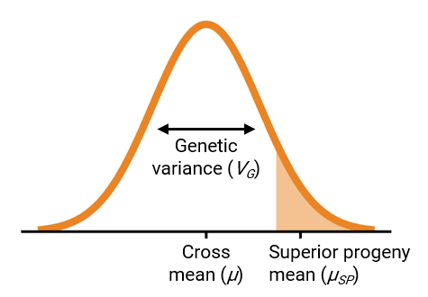

<!-- README.md is generated from README.Rmd. Please edit that file -->

```{r, include = FALSE}
knitr::opts_chunk$set(
  collapse = TRUE,
  comment = "#>",
  fig.path = "man/figures/README-",
  out.width = "100%"
)
```


# PopVar

<!-- badges: start -->

[](https://cran.r-project.org/package=PopVar)
[](https://app.travis-ci.com/UMN-BarleyOatSilphium/PopVar)

<!-- badges: end -->

## Introduction

To make progress in breeding, populations should have a favorable mean
and high genetic variance (Bernardo 2010). These two parameters can be
combined into a single measure called the usefulness criterion (Schnell
and Utz 1975), visualized in Figure 1.



Ideally, breeders would identify the set of parent combinations that,
when realized in a cross, would give rise to populations meeting these
requirements. `PopVar` is a package that uses phenotypic and genomewide
marker data on a set of candidate parents to predict the mean, genetic
variance, and superior progeny mean in bi-parental or multi-parental
populations. Thre package also contains functionality for performing
cross-validation to determine the suitability of different statistical
models. More details are available in Mohammadi, Tiede, and Smith (2015)
A dataset `think_barley` is included for reference and examples.

## Installation

You can install the released version of PopVar from
[CRAN](https://CRAN.R-project.org) with:

``` r
install.packages("PopVar")
```

And the development version from [GitHub](https://github.com/) with:

``` r
# install.packages("devtools")
devtools::install_github("UMN-BarleyOatSilphium/PopVar")
```


## What's new

In version 2.0, we added the following functionalities:

* ✅ Simpler functions for reading in and filtering genotypic and phenotypic data.  
* ✅ Support for outcrossing populations with heterozygous parents using phased marker genotypes


## Examples

Examples are outlined in the package vignette.

## References

<div id="refs" class="references csl-bib-body hanging-indent"
entry-spacing="0">

<div id="ref-Bernardo2010-iw" class="csl-entry">

Bernardo, Rex. 2010. *Breeding for Quantitative Traits in Plants*.
Woodbury, Minnesota: Stemma Press.

</div>

<div id="ref-Mohammadi2015-bx" class="csl-entry">

Mohammadi, Mohsen, Tyler Tiede, and Kevin P Smith. 2015. “PopVar: A
Genome-Wide Procedure for Predicting Genetic Variance and Correlated
Response in Biparental Breeding Populations.” *Crop Sci.* 55 (5):
2068–77. <https://doi.org/10.2135/cropsci2015.01.0030>.

</div>

<div id="ref-Schnell1975-hq" class="csl-entry">

Schnell, F W, and H F Utz. 1975. “F1-Leistung Und Elternwahl Euphyder
züchtung von Selbstbefruchtern.” In *Bericht
<span class="nocase">ü</span>ber Die Arbeitstagung Der Vereinigung
Österreichischer Pflanzenzüchter*, 243–48. Gumpenstein, Austria: BAL
Gumpenstein.

</div>

</div>
