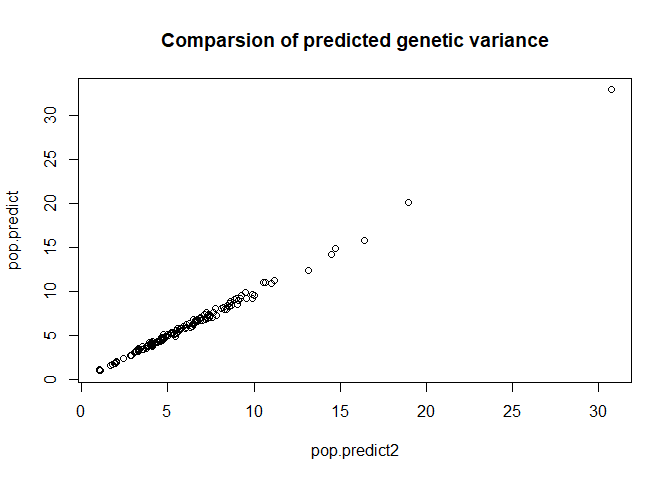

<!-- README.md is generated from README.Rmd. Please edit that file -->

# PopVar

<!-- badges: start -->

[](https://cran.r-project.org/package=PopVar)

<!-- badges: end -->

The main attribute of ‘PopVar’ is the prediction of genetic variance in
bi-parental populations, from which the package derives its name.
‘PopVar’ contains a set of functions that use phenotypic and genotypic
data from a set of candidate parents to 1) predict the mean, genetic
variance, and superior progeny value of all, or a defined set of
pairwise bi-parental crosses, and 2) perform cross-validation to
estimate genome-wide prediction accuracy of multiple statistical models.
More details are available in Mohammadi, Tiede, and Smith (2015). Crop
Sci. <doi:10.2135/cropsci2015.01.0030>. A dataset ‘think\_barley.rda’ is
included for reference and examples.

## Installation

You can install the released version of PopVar from
[CRAN](https://CRAN.R-project.org) with:

``` r
install.packages("PopVar")
```

And the development version from [GitHub](https://github.com/) with:

``` r
# install.packages("devtools")
devtools::install_github("UMN-BarleyOatSilphium/PopVar")
```

## Examples

Below are some example uses of the functions in `PopVar`:

``` r
# Load the package
library(PopVar)

# Load the example data
data("think_barley", package = "PopVar")
```

### Predictions using simulated populations

The code below simulates a single population of 1000 individuals for
each of 150 crosses. For the sake of speed, the marker effects are
predicted using RR-BLUP and no cross-validation is performed.

``` r
out <- pop.predict(G.in = G.in_ex, y.in = y.in_ex, map.in = map.in_ex,
                   crossing.table = cross.tab_ex,
                   nInd = 1000, nSim = 1, 
                   nCV.iter = 1, models = "rrBLUP")
```

The function returns a list, one element of which is called
`predictions.` This element is itself a list of matrices containing the
predictions for each trait. They can be combined as such:

``` r
predictions1 <- lapply(X = out$predictions, FUN = function(x) {
  x1 <- as.data.frame(apply(X = x, MARGIN = 2, FUN = unlist), stringsAsFactors = FALSE)
  cbind(x1[,c("Par1", "Par2")], sapply(X = x1[,-1:-2], as.numeric)) 
})

# Display the first few lines of the predictions for grain yield
knitr::kable(head(predictions1$Height_param.df))
```

| Par1     | Par2      | midPar.Pheno | midPar.GEBV |  pred.mu | pred.mu\_sd | pred.varG | pred.varG\_sd | mu.sp\_low | mu.sp\_high | low.resp\_FHB | low.resp\_DON | low.resp\_Yield | high.resp\_FHB | high.resp\_DON | high.resp\_Yield | cor\_w/\_FHB | cor\_w/\_DON | cor\_w/\_Yield |
| :------- | :-------- | -----------: | ----------: | -------: | ----------: | --------: | ------------: | ---------: | ----------: | ------------: | ------------: | --------------: | -------------: | -------------: | ---------------: | -----------: | -----------: | -------------: |
| FEG66-08 | MN97-125  |     76.95125 |    77.41518 | 77.37218 |          NA |  8.493440 |            NA |   72.44459 |    82.12881 |      26.97233 |      26.78294 |        101.7708 |       20.98313 |       21.96931 |         99.79476 |  \-0.8376592 |  \-0.8332852 |    \-0.3398524 |
| MN99-71  | FEG90-31  |          NaN |    76.76926 | 76.77932 |          NA |  5.736534 |            NA |   72.78777 |    80.70977 |      25.27847 |      26.47037 |         99.0850 |       20.88095 |       22.05171 |         98.96140 |  \-0.8330845 |  \-0.7901941 |    \-0.1459919 |
| MN96-141 | FEG183-52 |          NaN |    77.78444 | 77.73451 |          NA |  5.610929 |            NA |   73.60079 |    81.79936 |      27.69484 |      28.02633 |        103.3550 |       23.42191 |       24.32669 |         99.45916 |  \-0.8073730 |  \-0.6078383 |    \-0.5397480 |
| MN99-02  | FEG183-52 |          NaN |    74.16086 | 74.01553 |          NA |  7.748089 |            NA |   69.24221 |    78.80461 |      28.14699 |      27.74395 |        101.7818 |       23.95209 |       23.23075 |        100.26718 |  \-0.7493078 |  \-0.7019624 |    \-0.1462843 |
| FEG99-10 | FEG148-56 |          NaN |    82.92088 | 82.92209 |          NA |  8.357297 |            NA |   78.03203 |    87.84340 |      23.13545 |      23.80646 |        100.7068 |       19.18129 |       20.60340 |         96.61134 |  \-0.6939172 |  \-0.5319934 |    \-0.5734984 |
| MN99-62  | MN01-46   |     73.84625 |    73.67699 | 73.70421 |          NA |  1.560551 |            NA |   71.65045 |    75.83847 |      26.61991 |      29.19585 |        101.1645 |       25.77221 |       27.38567 |        103.23880 |  \-0.4446546 |  \-0.7395947 |      0.3947266 |

### Predictions using deterministic equations

Generating predictions via simulated populations can become
computationally burdensome when many thousands or hundreds of thousands
of crosses are possible. Fortunately, deterministic equations are
available to generate equivalent predictions in a fraction of the time.
These equations are provided in the `pop.predict2` and `pop_predict2`
functions.

The `pop.predict2` function takes arguments in the same format as
`pop.predict`. We have eliminated the arguments for marker filtering and
imputation and cross-validation, as the `pop.predict2` function does not
support these steps. (You may continue to conduct cross-validation using
the `x.val` function.) Therefore, the genotype data input for
`pop.predict2` **must not contain any missing data**. Further, these
predictions assume fully inbred parents, so marker genotypes must only
be coded as -1 or 1. The data `G.in_ex_imputed` contains genotype data
that is formatted properly.

Below is an example of using the `pop.predict2`
function:

``` r
out2 <- pop.predict2(G.in = G.in_ex_imputed, y.in = y.in_ex, map.in = map.in_ex,
                     crossing.table = cross.tab_ex, model = "rrBLUP")

knitr::kable(head(subset(out2, trait == "Height")))
```

|    | parent1  | parent2   | trait  | pred\_mu | pred\_varG | pred\_musp\_low | pred\_musp\_high | cor\_w\_FHB | cor\_w\_DON | cor\_w\_Yield | cor\_w\_Height | pred\_cor\_musp\_low\_FHB | pred\_cor\_musp\_low\_DON | pred\_cor\_musp\_low\_Yield | pred\_cor\_musp\_low\_Height | pred\_cor\_musp\_high\_FHB | pred\_cor\_musp\_high\_DON | pred\_cor\_musp\_high\_Yield | pred\_cor\_musp\_high\_Height |
| -- | :------- | :-------- | :----- | -------: | ---------: | --------------: | ---------------: | ----------: | ----------: | ------------: | -------------: | ------------------------: | ------------------------: | --------------------------: | ---------------------------: | -------------------------: | -------------------------: | ---------------------------: | ----------------------------: |
| 4  | FEG66-08 | MN97-125  | Height | 76.97925 |   7.012363 |        72.33190 |         81.62659 | \-0.8993096 | \-0.9075087 |   \-0.4004154 |             NA |                  27.17254 |                  27.79650 |                   102.37027 |                           NA |                   20.06531 |                   21.88425 |                     98.45305 |                            NA |
| 8  | MN99-71  | FEG90-31  | Height | 76.39911 |   5.237755 |        72.38263 |         80.41559 | \-0.8184618 | \-0.7416497 |   \-0.1612311 |             NA |                  25.83266 |                  26.65594 |                    99.63676 |                           NA |                   20.89235 |                   21.94262 |                     98.33416 |                            NA |
| 12 | MN96-141 | FEG183-52 | Height | 77.37677 |   7.528417 |        72.56146 |         82.19209 | \-0.8065814 | \-0.5374834 |   \-0.4603399 |             NA |                  28.43414 |                  27.86900 |                   102.97834 |                           NA |                   23.81243 |                   24.21640 |                     99.16440 |                            NA |
| 16 | MN99-02  | FEG183-52 | Height | 73.81471 |   7.905892 |        68.88015 |         78.74927 | \-0.7614047 | \-0.6811184 |   \-0.1929275 |             NA |                  28.35490 |                  27.48760 |                   101.87325 |                           NA |                   24.08864 |                   22.85390 |                     99.78610 |                            NA |
| 20 | FEG99-10 | FEG148-56 | Height | 83.25926 |   8.238843 |        78.22186 |         88.29666 | \-0.7467214 | \-0.5410256 |   \-0.5080571 |             NA |                  23.85526 |                  23.87921 |                    99.82614 |                           NA |                   19.20611 |                   19.94923 |                     96.20572 |                            NA |
| 24 | MN99-62  | MN01-46   | Height | 73.59232 |   1.712229 |        71.29589 |         75.88876 | \-0.6166794 | \-0.7085215 |     0.4010907 |             NA |                  26.67982 |                  29.16596 |                   100.98926 |                           NA |                   25.59940 |                   27.36630 |                    104.03262 |                            NA |

Note that the output of `pop.predict2` is no longer a list, but a data
frame containing the combined predictions for all traits.

The formatting requirements of `G.in` for `pop.predict` and
`pop.predict2` are admittedly confusing. Marker genotype data is
commonly stored as a *n* x *p* matrix, where *n* is the number of
entries and *p* the number of markers. The function `pop_predict2`
accommodates this general marker data storage. Here is an
example:

``` r
out3 <- pop_predict2(M = G.in_ex_mat, y.in = y.in_ex, map.in = map.in_ex,
                     crossing.table = cross.tab_ex, model = "rrBLUP")

knitr::kable(head(subset(out2, trait == "Height")))
```

|    | parent1  | parent2   | trait  | pred\_mu | pred\_varG | pred\_musp\_low | pred\_musp\_high | cor\_w\_FHB | cor\_w\_DON | cor\_w\_Yield | cor\_w\_Height | pred\_cor\_musp\_low\_FHB | pred\_cor\_musp\_low\_DON | pred\_cor\_musp\_low\_Yield | pred\_cor\_musp\_low\_Height | pred\_cor\_musp\_high\_FHB | pred\_cor\_musp\_high\_DON | pred\_cor\_musp\_high\_Yield | pred\_cor\_musp\_high\_Height |
| -- | :------- | :-------- | :----- | -------: | ---------: | --------------: | ---------------: | ----------: | ----------: | ------------: | -------------: | ------------------------: | ------------------------: | --------------------------: | ---------------------------: | -------------------------: | -------------------------: | ---------------------------: | ----------------------------: |
| 4  | FEG66-08 | MN97-125  | Height | 76.97925 |   7.012363 |        72.33190 |         81.62659 | \-0.8993096 | \-0.9075087 |   \-0.4004154 |             NA |                  27.17254 |                  27.79650 |                   102.37027 |                           NA |                   20.06531 |                   21.88425 |                     98.45305 |                            NA |
| 8  | MN99-71  | FEG90-31  | Height | 76.39911 |   5.237755 |        72.38263 |         80.41559 | \-0.8184618 | \-0.7416497 |   \-0.1612311 |             NA |                  25.83266 |                  26.65594 |                    99.63676 |                           NA |                   20.89235 |                   21.94262 |                     98.33416 |                            NA |
| 12 | MN96-141 | FEG183-52 | Height | 77.37677 |   7.528417 |        72.56146 |         82.19209 | \-0.8065814 | \-0.5374834 |   \-0.4603399 |             NA |                  28.43414 |                  27.86900 |                   102.97834 |                           NA |                   23.81243 |                   24.21640 |                     99.16440 |                            NA |
| 16 | MN99-02  | FEG183-52 | Height | 73.81471 |   7.905892 |        68.88015 |         78.74927 | \-0.7614047 | \-0.6811184 |   \-0.1929275 |             NA |                  28.35490 |                  27.48760 |                   101.87325 |                           NA |                   24.08864 |                   22.85390 |                     99.78610 |                            NA |
| 20 | FEG99-10 | FEG148-56 | Height | 83.25926 |   8.238843 |        78.22186 |         88.29666 | \-0.7467214 | \-0.5410256 |   \-0.5080571 |             NA |                  23.85526 |                  23.87921 |                    99.82614 |                           NA |                   19.20611 |                   19.94923 |                     96.20572 |                            NA |
| 24 | MN99-62  | MN01-46   | Height | 73.59232 |   1.712229 |        71.29589 |         75.88876 | \-0.6166794 | \-0.7085215 |     0.4010907 |             NA |                  26.67982 |                  29.16596 |                   100.98926 |                           NA |                   25.59940 |                   27.36630 |                    104.03262 |                            NA |

#### Benchmarking and comparisons

The code below compares the functions `pop.predict` and `pop.predict2`
with respect to computation time and results:

``` r
time1 <- system.time({
  capture.output(pop.predict.out <- pop.predict(
    G.in = G.in_ex_imputed, y.in = y.in_ex, map.in = map.in_ex, crossing.table = cross.tab_ex,
    nInd = 1000, nSim = 1, nCV.iter = 1, models = "rrBLUP"))
})

time2 <- system.time({pop.predict2.out <- pop.predict2(
  G.in = G.in_ex_imputed, y.in = y.in_ex, map.in = map.in_ex,
  crossing.table = cross.tab_ex,model = "rrBLUP")})

c(pop.predict = time1[[3]], pop.predict2 = time2[[3]])
##  pop.predict pop.predict2 
##         22.1          0.5
```

Plot
results

``` r
predictions1 <- lapply(X = pop.predict.out$predictions, FUN = function(x) {
  x1 <- as.data.frame(apply(X = x, MARGIN = 2, FUN = unlist), stringsAsFactors = FALSE)
  cbind(x1[,c("Par1", "Par2")], sapply(X = x1[,-1:-2], as.numeric))
})

pop.predict.out1 <- predictions1$Yield_param.df[,c("Par1", "Par2", "pred.varG")]
pop.predict2.out1 <- subset(pop.predict2.out, trait == "Yield", c(parent1, parent2, pred_varG))

toplot <- merge(pop.predict.out1, pop.predict2.out1, by.x = c("Par1", "Par2"),
                by.y = c("parent1", "parent2"))

plot(pred.varG ~ pred_varG, toplot,
     xlab = "pop.predict2", ylab = "pop.predict",
     main = "Comparsion of predicted genetic variance")
```



### Multi-parent populations
